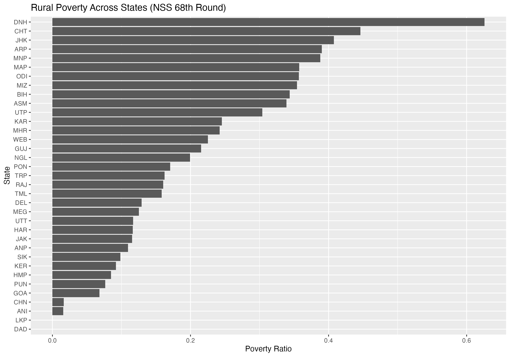
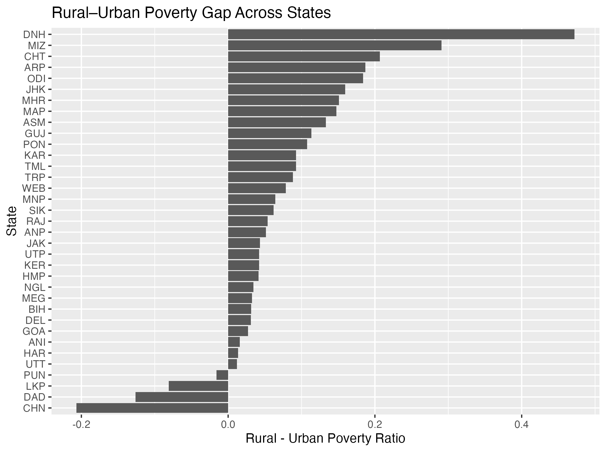

#  Objective - State-wise Poverty Estimation in India
NSS 68th Round (2011–12) - Household Consumer Expenditure Survey

This project estimates rural and urban poverty ratios across Indian states and Union Territories using microdata
from the NSS 68th Round Consumer Expenditure Survey (2011–12). By applying the official Tendulkar poverty
lines, the analysis produces household-weighted, sector-specific poverty ratios that capture both the level and
distribution of poverty across 35 states and UTs, enabling meaningful comparisons of regional deprivation.

## Data

The primary dataset is the NSS 68th Round Schedule 1.0 (Type 1), accessed 
as fixed-width text files from MOSPI. The raw data files are not included 
here as they are licensed — they can be downloaded from 
[mospi.gov.in](https://mospi.gov.in).

The survey has 11 record levels. This analysis uses Levels 1, 2, and 3:

- **Level 1** — household identifiers, state, sector, sampling multiplier
- **Level 2** — household size
- **Level 3** — pre-aggregated summary MPCE (URP and MRP-based)

Levels 4–10 contain item-level expenditure records that feed into the 
Block 12 summary already present in Level 3. Since Level 3 contains the 
final MRP-based MPCE used in official poverty estimation, rebuilding it 
from item-level records would produce an identical result. Using Level 3 
directly is the standard approach for head-count poverty estimation.

The official Tendulkar Committee poverty lines for 2011–12, disaggregated by state and sector, serve as the
threshold for poverty classification. State codes are mapped to three-letter abbreviations using a separate
crosswalk file for labelling and visualisation. Included as `Tendulkar_Povertyline__1_.xlsx`.

## Methodology

Records from Levels 1, 2, and 3 are merged on four household identifiers: 
FSU code, hamlet-group/sub-block number, second-stage stratum, and household 
number. The Tendulkar poverty line for each state-sector pair is then joined 
to the household record.

A household is classified as poor if its MRP-based MPCE falls below the 
applicable poverty line. Sampling weights are the raw multiplier divided by 
100. Poverty ratios are computed as weighted means of the poverty indicator, 
weighted by `weight × household size`.

# Validation

Results are consistent with official Planning Commission estimates for 2011–12.
DNH (62.6% rural poverty), Chhattisgarh (44.6%), and Kerala (9.2%) all match 
published figures closely. Small differences exist for certain UTs where the 
Planning Commission applied state-level proxy adjustments — this analysis 
applies the Tendulkar lines directly and uniformly.

## Key Findings

- Rural poverty exceeds urban poverty in almost every state, confirming 
  persistent sector-level disparities in consumption.
- DNH records the highest rural poverty (62.6%), driven by extreme intra-UT 
  inequality between its industrial belt and tribal rural settlements — 
  structurally different from high-poverty states like Chhattisgarh or Jharkhand.
- Bihar has one of the smallest rural–urban gaps (3.2 pp) but high absolute 
  poverty in both sectors, pointing to generalised deprivation rather than 
  a sectoral divide.
- Southern and coastal states (Kerala 9.2%, Goa 6.8%) record the lowest 
  rural poverty.
- North-eastern states show elevated rural poverty despite low population 
  density, reflecting geographical isolation and weak market integration.

## Outputs

- `state_poverty_estimates.csv` — poverty ratios for all 35 states/UTs by sector
- `rural_poverty_states.png` — states ranked by rural poverty ratio
- `rural_urban_gap.png` — rural minus urban poverty ratio by state

## Visualisations

## Tools

R — vroom, dplyr, readxl, ggplot2, ineq, openxlsx

## Data Source

National Sample Survey Office. *Household Consumer Expenditure Survey, 
NSS 68th Round (July 2011 – June 2012).* MOSPI, Government of India.

Planning Commission, Government of India. *Tendulkar Committee Poverty 
Lines, 2011–12.*
